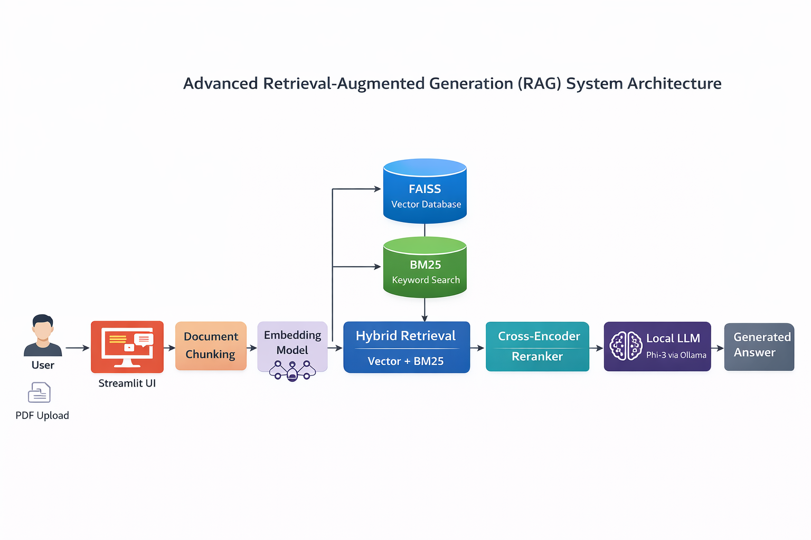
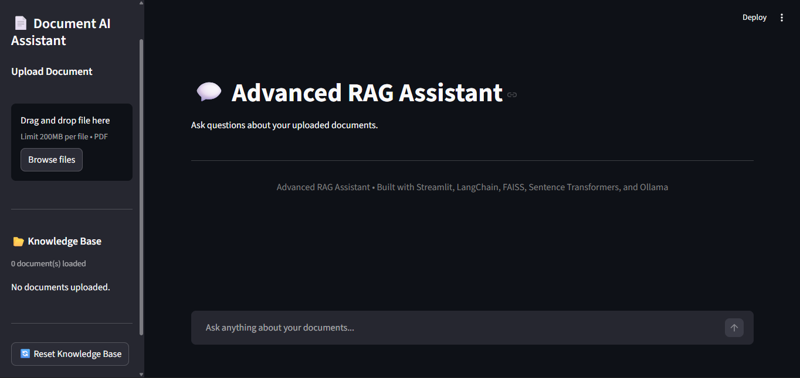
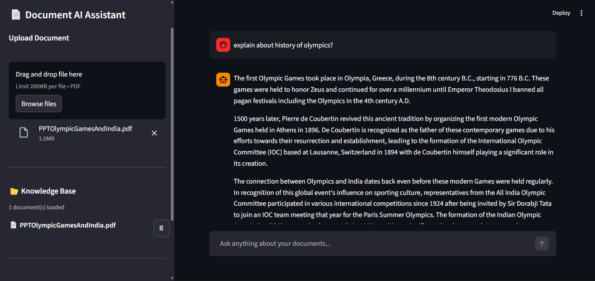
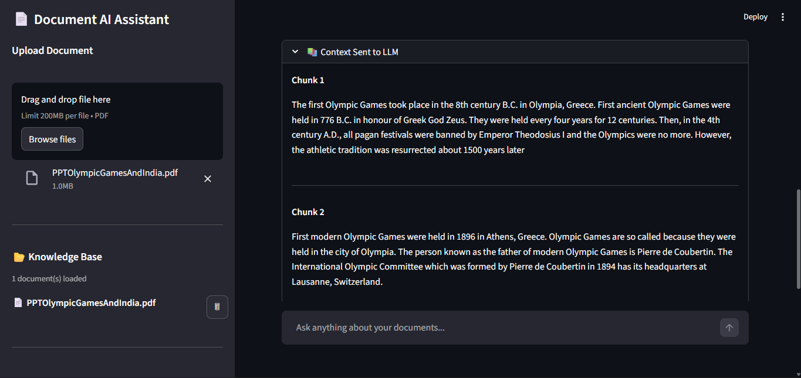
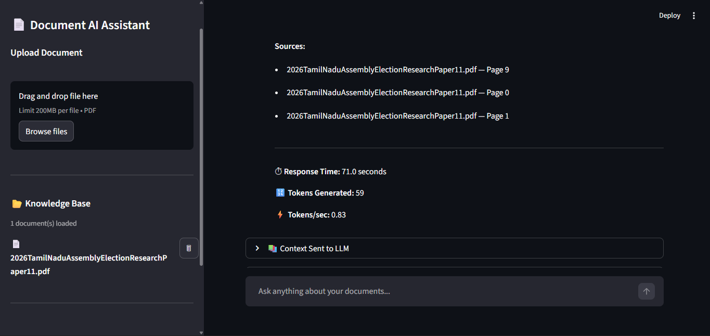
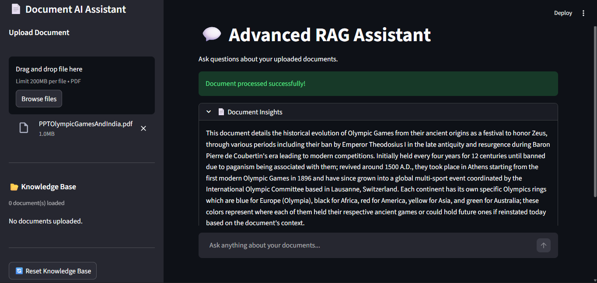

# 🤖 Advanced RAG Assistant

An Advanced Retrieval-Augmented Generation (RAG) document assistant built using Python, LangChain, FAISS, and a local LLM.

This project demonstrates how modern GenAI knowledge assistants** retrieve information from documents and generate accurate, grounded answers using Large Language Models.

The system includes hybrid retrieval, reranking, streaming responses, observability metrics, and an interactive UI.

---

# Overview

Large Language Models cannot efficiently process large documents due to context window limitations.

**Retrieval-Augmented Generation (RAG) solves this by retrieving the most relevant document chunks and providing that context to the LLM before generating a response.

This project implements a production-style RAG architecture used in modern AI assistants.

---

# Why This Project Matters

Modern AI assistants rely on Retrieval-Augmented Generation to provide reliable responses grounded in external knowledge.

This project demonstrates key techniques used in enterprise GenAI systems:

• Hybrid retrieval (dense + sparse search)
• Cross-encoder reranking
• Local LLM inference
• Retrieval transparency and debugging
• Streaming responses

These techniques are widely used in AI knowledge assistants, internal documentation bots, and enterprise AI systems.

---

# System Architecture

The system follows a modern **RAG pipeline**.

PDF Upload
↓
LangChain PDF Loader
↓
Recursive Text Splitter
↓
Text Chunks
↓
Embedding Model (all-MiniLM-L6-v2)
↓
FAISS Vector Database
↓
Hybrid Retrieval
(Vector Search + BM25)
↓
Cross Encoder Reranker
↓
Local LLM (Phi-3 via Ollama)
↓
Streaming AI Response

---

# Project Structure

advanced-rag-assistant
│
├── app.py
│
├── src
│   ├── pdf_loader.py
│   ├── text_splitter.py
│   ├── vector_store.py
│   ├── hybrid_retriever.py
│   ├── reranker.py
│   ├── summarizer.py
│   └── llm.py
│
├── uploaded_docs
├── faiss_index
│
├── assets
│   ├── architecture.png
│   ├── homepage.png
│   ├── chat.png
│   ├── chunks.png
│   ├── rag_retrieval_results.png
│   └── document_summarizer.png
│
├── requirements.txt
└── README.md

---

# Tech Stack

## Programming Language

Python

## GenAI Frameworks

• LangChain
• Sentence Transformers
• FAISS
• Rank-BM25
• Ollama

## Models

### Embedding Model

all-MiniLM-L6-v2

### Reranker Model

bge-reranker-base

### LLM

Phi-3 (running locally via Ollama)

---

# Key Features

## Document Processing

• PDF document ingestion
• Automatic text chunking
• Embedding generation
• FAISS vector storage

---

## Retrieval System

• Hybrid retrieval combining dense vector search (FAISS) with sparse keyword retrieval (BM25)
• Cross-encoder reranking for improved relevance
• Semantic document search

---

## AI Generation

• Local LLM responses (Phi-3)
• Streaming answers
• Context-aware generation

---

## UI Features

• Streamlit-based chat interface
• Knowledge base manager
• Document upload system
• Context viewer
• Retrieval debug panel
• Document summary generation

---

## Observability

• Response time metrics
• Token generation statistics
• Retrieval source transparency
• Context inspection panel

---

# Performance & Observability

The system provides runtime observability to help understand how the RAG pipeline behaves during inference.

Metrics displayed in the UI include:

• Response Time – total latency for retrieval and generation
• Tokens Generated – number of tokens produced by the LLM
• Tokens per Second – generation throughput
• Retrieved Sources – document chunks used for answering
• Context Sent to LLM – retrieved text passed to the model

These metrics help debug retrieval quality and monitor system performance in real time.

---

# How the System Works

1. User uploads a PDF document.

2. The system splits the document into semantic chunks.

3. Each chunk is converted into vector embeddings.

4. Embeddings are stored in a FAISS vector database.

5. When the user asks a question:

   • Vector search retrieves relevant chunks
   • BM25 performs keyword-based retrieval
   • Results are reranked using a cross-encoder

6. The top ranked context is sent to a local LLM.

7. The LLM generates the final grounded answer.

---

# Example Query

### User Question

What is Retrieval-Augmented Generation?

### System Process

1. Convert question into embedding
2. Retrieve relevant chunks from FAISS
3. Apply keyword retrieval (BM25)
4. Rerank results using cross-encoder
5. Send context to LLM
6. Generate grounded response

### Example Answer

Retrieval-Augmented Generation (RAG) is an architecture that combines information retrieval with large language models. The system retrieves relevant information from external documents and provides that context to the LLM before generating an answer.

---

# Screenshots

## System Architecture

## Application Homepage

## Chat Interface

## Document Chunking

## Retrieval Results

## Document Summarization

---

# Setup Instructions

## Clone Repository

git clone https://github.com/Nithish7383/advanced-rag-assistant.git

cd advanced-rag-assistant

---

## Create Virtual Environment

python -m venv venv

Activate it

### Windows

venv\Scripts\activate

### Mac / Linux

source venv/bin/activate

---

## Install Dependencies

pip install -r requirements.txt

---

## Install Ollama

Download Ollama:

https://ollama.ai

Pull the model:

ollama pull phi3

---

## Run the Application

streamlit run app.py

---

# Future Improvements

• Multi-document knowledge base
• Query expansion
• Model switching (Phi-3 / Mistral / Gemma)
• Docker deployment
• Cloud deployment

---

# Learning Goals

This project demonstrates key concepts used in real-world GenAI systems:

• Retrieval-Augmented Generation
• Hybrid document retrieval
• Vector databases
• LLM orchestration
• AI document assistants

---

# Author

**Nithish**

AI / GenAI Engineer

Specializing in:

• Retrieval-Augmented Generation (RAG)
• LLM Applications
• AI Automation Systems

GitHub
https://github.com/Nithish7383
